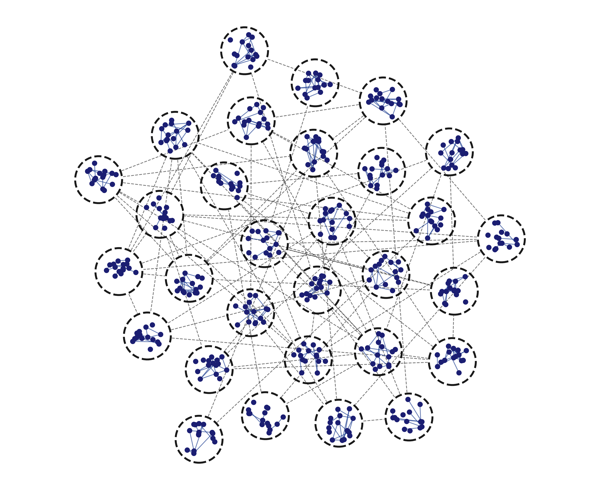
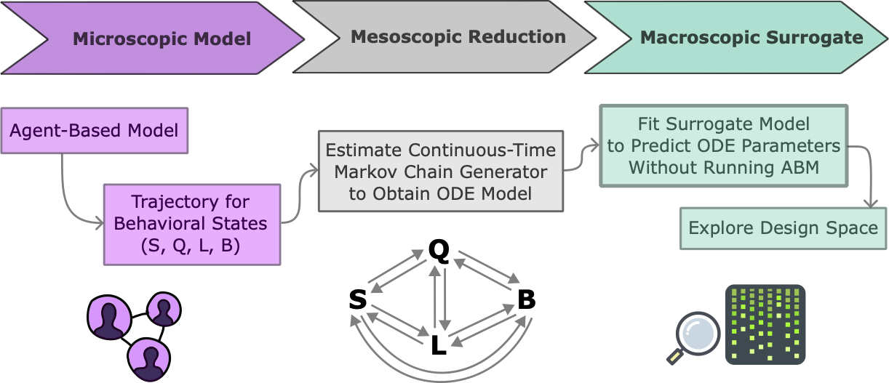

# Designing for AI Adoption: A Multi-Scale Modeling Framework for Engineering Organizations

Submitted to ASME IDETC



## Overview
This project develops a multi-scale computational pipeline for studying AI adoption in engineering organizations. The framework connects agent-based modeling, reduced-order dynamical modeling, and decision-space exploration.

At the microscopic level, an agent-based model (ABM) simulates how individual engineers update their opinions about AI through observed technology outcomes and social interactions within an organization. These agent-level dynamics are then aggregated into organizational behavioral-state trajectories (SQLB), reduced to a continuous-time ODE representation through CTMC generator fitting, and used to estimate steady-state adoption outcomes across the design space.

```text
Agent-Based Model
        ↓
Organizational State Aggregation (SQLB)
        ↓
ODE Reduction (CTMC Generator Fit)
        ↓
Surrogate / Steady-State Adoption Estimation
        ↓
Design-Space Analysis
```



This structure allows complex behavioral dynamics to be translated into interpretable policy and strategy tradeoffs.

## Reproducing the Full Simulation–Reduction–Decision Pipeline

To rerun the complete experimental and analysis workflow from scratch, execute the following steps in order.

This pipeline runs and transforms agent-based simulations into a reduced ODE model and finally into a decision-oriented tradeoff surface.

### Step 0: 

Clone the repository and install the required dependencies:
```
pip install -r requirements.txt
```
This installs all Python packages needed to run the full simulation–reduction–decision pipeline. Python 3.11 or higher is required. It is recommended to use a virtual environment.

### Step 1: Run `config.py`

This script defines the full experimental design grid and generates all parameter combinations. These are saved to `settings.csv` file. Each row represents one simulation configuration.

### Step 2: Run `run.py`

This script reads the configurations from settings.csv, constructs the corresponding models, and runs the simulations in parallel. The results are saved to the `models/` directory as `<model_name>.json`.

### (Optional) Step 3: Run `network_visualization.py`

This script creates the network representation of example organizations and saved them to `figures/` directory.

### Step 4: Run `state.py`

This script loads the simulation results from the `models/` directory and computes the organizational SQLB state ratios at each time step. The state at each timestep are saved to the `states/` directory as `<model_name>.csv`.

### Step 5: Run `fit_ode.py`

This script loads the states for each model configuration from the `states/` directory and fits a continuous-time ODE model to estimate transition constants. The fitted ODE parameters are saved to the `odes/` directory as `<model_name>.npz`.

### Step 6: Run `validate_fitted_ode.py`

This scripts runs validation pipeline to check goodness of fit for ODEs compared to ABM trajectory.

### Step 7: Run `select_surrogate_model.py`

This script loads the fitted ODE results from the `odes/` directory and checks the different polynomial degrees that can be fitted to the ODE parameters. The goal is to find the proper degree of polynomial to create surrogate model to explore the design space without needing to run simulation. It saves train vs. validation error figure in `figures/surrogate_model_selection.png` for different polynomials.

### Step 8: Run `create_surrogate.py`

This script builds the surrogate model that maps design inputs
(`teams_num`, `teams_size`, `agents_average_initial_opinion`, `technology_success_rate`)
to ODE transition rates. It:

1. Loads fitted ODE targets from `odes/<model_name>.npz` and inputs from `settings.csv`.
2. Standardizes inputs and builds polynomial features.
3. Fits a multi-output linear regression model for all off-diagonal SQLB transitions.
4. Saves the trained surrogate artifact to:
   - `surrogates/ode_rate_surrogate.npz`

Note: The polynomial degree is controlled by `POLY_DEGREE` in `create_surrogate.py`
(choose this based on Step 7 results).

### Step 9: Run `validate_surrogate.py`

This script validates surrogate-predicted trajectories against ABM trajectories
across all model configurations. It:

1. Loads ABM state trajectories from `states/`.
2. Uses `settings.csv` + surrogate model to predict a generator for each model.
3. Simulates surrogate trajectories and compares them with ABM trajectories.
4. Computes trajectory/final-time error metrics.
5. Saves outputs:
   - `validation_abm_to_surrogate.csv` (per-model metrics)
   - `figures/validation_abm_to_surrogate_hist_*.png` (error histograms)
   - `figures/validation_abm_to_surrogate_parity_*.png` (parity plots)
   - `figures/validation_abm_to_surrogate/validation_abm_to_surrogate_overlay_<model>.png` (example overlays)

### (Optional) Step 10: Run `plot_trajectories.py`

This script visualizes trajectory-level comparisons for:

- ABM state trajectories
- ABM vs fitted ODE trajectories
- ABM vs surrogate ODE trajectories

It is used as a qualitative validation step to inspect how closely both reduced
models reproduce the SQLB dynamics over time.

### Step 11: Run `plot_min_accuracy.py`

This script uses the surrogate steady-state prediction to compute the minimum
AI success rate required to achieve a target adoption level (`Q + L`) for each
organization structure setting (team count and team size). It generates heatmaps
for selected initial-opinion scenarios and saves figures to `figures/`, e.g.:

- `figure_structure_min_accuracy_pos.png`
- `figure_structure_min_accuracy_neg.png`

### Step 12: Run `plot_loud_share_vs_accuracy.py`

This script analyzes adoption composition versus AI accuracy using the surrogate.
For each scenario, it computes:

- loud adopter share: `L / (Q + L)`
- quiet adopter share: `Q / (Q + L)`
- total adoption: `Q + L`

It renders a 2×2 comparison grid across organization size and initial-opinion sign,
and saves the figure to `figures/` (default: `figure_loud_share_grid.png`).
